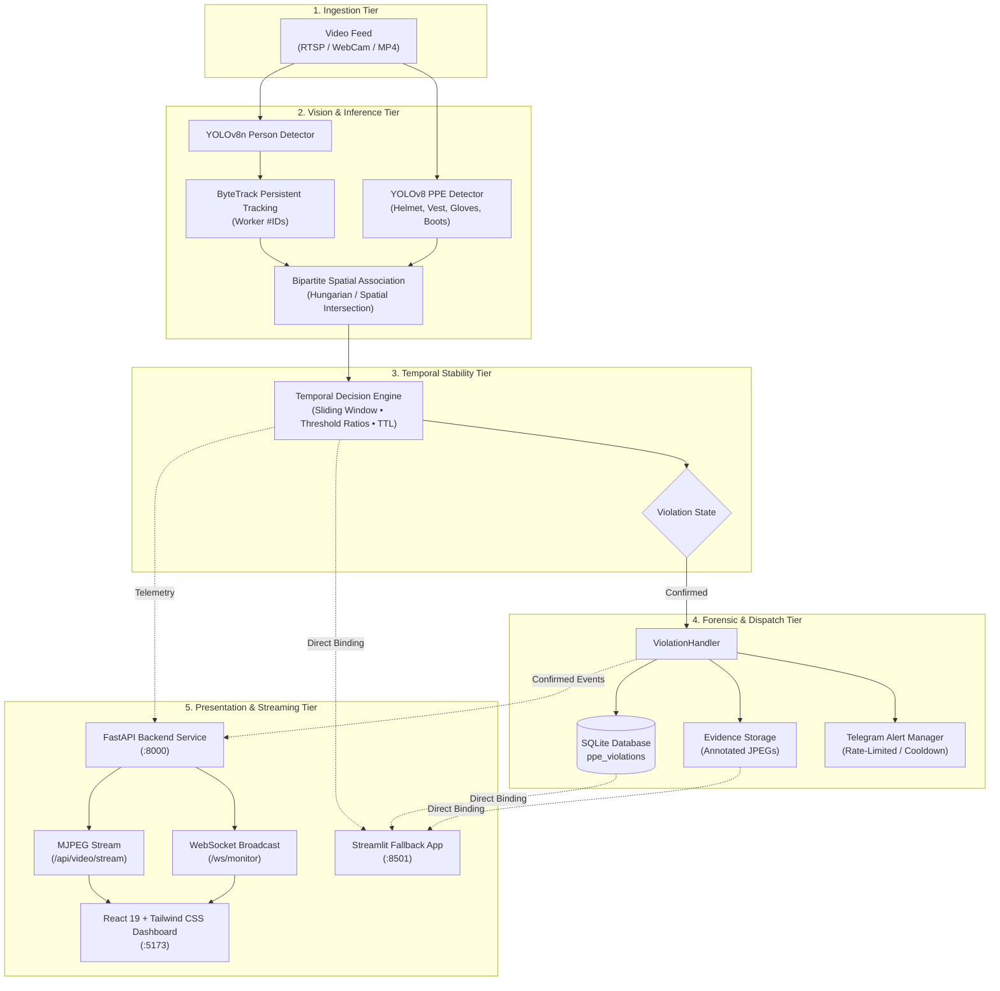

<div align="center">

# 🦺 Industrial Safety Violation Detector
### Real-Time PPE Compliance, Temporal Stability Engine & Multi-Tier Monitoring System

[](https://python.org)
[](https://fastapi.tiangolo.com)
[](https://react.dev)
[](https://vitejs.dev)
[](https://tailwindcss.com)
[](https://ultralytics.com)
[](#-testing--qa-verification)
[](LICENSE)

<br/>

> **An enterprise-grade, edge-deployable computer vision platform that detects personal protective equipment (PPE) violations on workers in real-time, validates stability through sliding-window temporal engines, dispatches sub-second WebSocket alerts, and persists high-resolution forensic evidence.**

</div>

---

## 📑 Table of Contents

- [✨ Key Capabilities](#-key-capabilities)
- [🏛️ System Architecture](#️-system-architecture)
- [🔬 Core AI & Vision Pipeline](#-core-ai--vision-pipeline)
- [🖥️ User Interfaces](#️-user-interfaces)
  - [Modern Web Dashboard (FastAPI + React)](#1-modern-web-dashboard-fastapi--react)
  - [Streamlit Fallback / Academic Demo](#2-streamlit-fallback--academic-demo)
- [⚡ Quick Start Guide](#-quick-start-guide)
- [📡 API & WebSocket Reference](#-api--websocket-reference)
- [🛡️ Security & Integrity](#️-security--integrity)
- [🧪 Testing & QA Verification](#-testing--qa-verification)
- [⚙️ Configuration Parameters](#️-configuration-parameters)
- [📄 License & Authors](#-license--authors)

---

## ✨ Key Capabilities

<table>
  <tr>
    <td width="50%">
      <h3>👁️ Precision Vision & Tracking</h3>
      <ul>
        <li><strong>Dual-Detector Topology</strong>: Decoupled YOLOv8n worker detector + custom YOLOv8 PPE equipment detector.</li>
        <li><strong>ByteTrack Persistent IDs</strong>: Continuous tracking through severe occlusions and motion blur.</li>
        <li><strong>Bipartite Spatial Association</strong>: Bounding box topology and geometric intersection matching for robust worker-to-gear binding.</li>
      </ul>
    </td>
    <td width="50%">
      <h3>⏳ Temporal Stability Engine</h3>
      <ul>
        <li><strong>Sliding-Window Deque</strong>: Anti-flicker debouncing engine over customizable frame windows.</li>
        <li><strong>Zero False Accusations</strong>: Explicit 3-tier status hierarchy: <code>NORMAL</code> → <code>SUSPECTED</code> → <code>CONFIRMED</code>.</li>
        <li><strong>Strict PPE Semantics</strong>: Unobserved items remain <code>UNKNOWN</code> (never prematurely marked safe).</li>
      </ul>
    </td>
  </tr>
  <tr>
    <td width="50%">
      <h3>⚡ Real-Time Streaming & Alerts</h3>
      <ul>
        <li><strong>Unified Inference Loop</strong>: Single-pass pipeline prevents duplicate model inference across multiple clients.</li>
        <li><strong>Sub-second WebSockets</strong>: Instantaneous JSON event broadcast to all connected dashboards.</li>
        <li><strong>In-Browser Multi-Sensory Alerting</strong>: Glowing HUD banners, synthesized Web Audio alarm chimes, and Browser Push Notifications.</li>
      </ul>
    </td>
    <td width="50%">
      <h3>🗄️ Forensic Persistence & Export</h3>
      <ul>
        <li><strong>Automated Evidence Crops</strong>: Cropped worker image with embedded metadata header overlay.</li>
        <li><strong>SQLite Storage</strong>: Idempotent event persistence with rich audit columns.</li>
        <li><strong>Interactive Audit & Export</strong>: Multi-attribute filtering (Severity, Category, Worker ID) and instant CSV export.</li>
      </ul>
    </td>
  </tr>
</table>

---

## 🏛️ System Architecture



---

## 🔬 Core AI & Vision Pipeline

The system operates across a strictly staged 8-phase pipeline designed for reliability and zero hallucination:

```
Video Frame
    │
    ├──► 1. Person Detection (YOLOv8n) ──► Worker Bboxes
    │                                             │
    │                                             ▼
    │                                     2. ByteTrack Tracking ──► Worker #ID
    │                                                                   │
    ├──► 3. PPE Item Detection (YOLOv8) ──► PPE Detections              │
    │                                             │                     │
    │                                             ▼                     ▼
    │                                     4. Spatial Association Engine
    │                                        (PRESENT | NOT_ASSOCIATED | UNKNOWN)
    │                                                                   │
    │                                                                   ▼
    │                                     5. Sliding-Window Temporal Engine
    │                                        (NORMAL ──► SUSPECTED ──► CONFIRMED)
    │                                                                   │
    │                                                                   ▼
    ▼                                                            6. Confirmed Event
Annotated Frame                                                         │
    │                                                ┌──────────────────┼──────────────────┐
    ▼                                                ▼                  ▼                  ▼
MJPEG Stream                                  Crop Evidence       SQLite Log         Telegram
(/api/video/stream)                          (event_*.jpg)     (ppe_violations)   (Rate-limited)
```

---

## 🖥️ User Interfaces

### 1. Modern Web Dashboard (FastAPI + React)
- **Engine**: React 19 + Tailwind CSS v4 + Lucide Icons + Vite.
- **Real-Time Feed**: Low-latency MJPEG video player side-by-side with dynamic Worker PPE Cards.
- **Auditing Suite**: Searchable violation history table with instant filters, inline forensic preview, and CSV export.
- **Live Notifications**: Audio alarm chimes (Web Audio API), glowing HUD alert cards, and OS-level browser push notifications.

### 2. Streamlit Fallback / Academic Demo
- **Engine**: Streamlit (`app.py`).
- **Purpose**: Zero-dependency academic presentation mode, rapid testing, and standalone evaluation interface.

---

## ⚡ Quick Start Guide

### Prerequisites
- Python 3.10 or higher
- Node.js 18+ and npm
- Valid model weights placed in workspace (`yolov8n.pt` and `models/ppe_yolov8n_best.pt`)

### 1. Clone & Environment Setup
```bash
# Clone the repository
git clone https://github.com/AyushPrad2907/Industrial-Safety-Violation-detector.git
cd Industrial-Safety-Violation-detector

# Install Python backend dependencies
pip install -r requirements.txt

# Install React frontend dependencies
cd frontend
npm install
cd ..
```

### 2. Run the Modern Web Application

Open two terminal sessions:

**Terminal 1 — FastAPI Backend:**
```bash
python -m uvicorn backend.main:app --host 0.0.0.0 --port 8000 --reload
```
*API Swagger Documentation: [http://localhost:8000/docs](http://localhost:8000/docs)*

**Terminal 2 — React Dashboard:**
```bash
cd frontend
npm run dev
```
*Web Application UI: [http://localhost:5173](http://localhost:5173)*

---

### 3. Run the Streamlit Fallback UI
```bash
python -m streamlit run app.py
```
*Streamlit UI: [http://localhost:8501](http://localhost:8501)*

---

## 📡 API & WebSocket Reference

### REST Endpoints

| Method | Endpoint | Description |
| :--- | :--- | :--- |
| `GET` | `/api/health` | System health check (database connection, pipeline status) |
| `GET` | `/api/status` | Component statuses (AI, WebSockets, DB, Video, Telegram) |
| `GET` | `/api/stats` | Real-time FPS, frame index, latency (ms), worker & violation counts |
| `GET` | `/api/workers` | Currently tracked active workers with detailed PPE state map |
| `POST` | `/api/monitoring/start` | Initiates unified background video inference loop |
| `POST` | `/api/monitoring/stop` | Halts active monitoring loop gracefully |
| `GET` | `/api/video/stream` | Multi-client annotated MJPEG video stream |
| `GET` | `/api/violations` | Filterable SQLite violation history (`severity`, `type`, `worker_id`) |
| `GET` | `/api/violations/{id}` | Detailed record for a specific violation event |
| `GET` | `/api/violations/export/csv` | Download filtered violation records as formatted CSV |
| `GET` | `/api/evidence/{id}` | Secure JPEG evidence serving with path-traversal protection |
| `POST` | `/api/session/reset` | Resets tracking state (preserves DB history and evidence) |

### WebSocket Protocol

- **Endpoint**: `ws://localhost:8000/ws/monitor`
- **Events**:
  - `monitoring_update`: Telemetry packet dispatched ~3 times per second.
  - `violation_confirmed`: Real-time safety alert dispatched instantly upon temporal confirmation.

```json
{
  "type": "violation_confirmed",
  "data": {
    "event_id": "evt_worker2_helmet_01",
    "track_id": 2,
    "violation_type": "Missing Helmet",
    "severity": "CRITICAL",
    "decision_score": 0.92,
    "missing_ratio": 0.85,
    "timestamp": "2026-10-07 13:00:00",
    "evidence_path": "evidence/event_evt_worker2_helmet_01.jpg",
    "is_zone_violation": false,
    "message": "Worker #2 confirmed missing helmet"
  }
}
```

---

## 🛡️ Security & Integrity

- **Path Traversal Protection**: Evidence serving strictly resolves target paths within `EVIDENCE_DIR`, blocking directory escapes (`HTTP 403 Forbidden`).
- **Credential Masking**: Telegram bot tokens and chat IDs are kept isolated and are never exposed across API responses.
- **Client Disconnect Resilience**: Graceful WebSocket disconnect management ensures a disconnected client never interrupts the primary inference loop.
- **CORS Hardening**: Explicit origin configuration restricting access to legitimate development/production hosts.

---

## 🧪 Testing & QA Verification

The project includes an automated test suite spanning **8 phases** with **110 unit and integration tests**:

```bash
python -m unittest discover -s . -p "test_phase*.py"
```

```
..............................................................................................................
----------------------------------------------------------------------
Ran 110 tests in 5.25s

OK
```

### Coverage by Phase:
- **Phase 1** (`test_phase1.py`): Polygon zone geometry parsing & video source handling (12 tests)
- **Phase 2** (`test_phase2.py`): ByteTrack worker tracking & tracker structures (6 tests)
- **Phase 3** (`test_phase3.py`): PPE YOLOv8 inference & annotation formatting (5 tests)
- **Phase 4** (`test_phase4.py`): Worker ↔ PPE bipartite spatial association (17 tests)
- **Phase 5** (`test_phase5.py`): Sliding-window temporal engine & debouncing (16 tests)
- **Phase 6** (`test_phase6.py`): Evidence crop generation, SQLite logging & Telegram rate limits (20 tests)
- **Phase 7** (`test_phase7.py`): Streamlit dashboard utilities, CSV export & safe session reset (18 tests)
- **Phase 8** (`test_phase8.py`): FastAPI REST endpoints, WebSockets, evidence security & regression (16 tests)

---

## ⚙️ Configuration Parameters

Key application settings can be configured via `.env`:

```ini
# Core Vision Models
DEFAULT_MODEL_WEIGHTS=yolov8n.pt
DEFAULT_PPE_MODEL_WEIGHTS=models/ppe_yolov8n_best.pt
DEFAULT_CONFIDENCE=0.40
DEFAULT_PPE_CONFIDENCE=0.35
DEFAULT_ASSOCIATION_THRESHOLD=0.35

# Phase 5: Temporal Decision Engine
TEMPORAL_WINDOW_SIZE=12
VIOLATION_RATIO_THRESHOLD=0.70
MIN_OBSERVABLE_FRAMES=5
TRACK_HISTORY_TTL=30

# Persistence & Alerts
DATABASE_PATH=data/violations.db
EVIDENCE_DIR=evidence
TELEGRAM_ALERTS_ENABLED=false
TELEGRAM_BOT_TOKEN=
TELEGRAM_CHAT_ID=
TELEGRAM_ALERT_COOLDOWN_SECONDS=60
```

---

<div align="center">

Built with ❤️ for workplace safety and industrial health monitoring.

</div>